# 📚 AHBookStore - Testing Walkthrough

This document showcases comprehensive testing of the AHBookStore Django application deployed at [https://ahbookstore.onrender.com/](https://ahbookstore.onrender.com/). All tests were executed with browser interactions and recorded for demonstration.

---

## Test Environment

- **Live Application**: https://ahbookstore.onrender.com/
- **Testing Date**: December 8, 2025
- **Test Users Created**:
  - `testuser_1765200318` (password: `TestPass123!`)
  - `testuser2_1765200938` (password: `TestPass123!`)

---

## Test Coverage Summary

| Test Category | Test Cases | Status |
|--------------|------------|--------|
| Homepage & Navigation | 2 | ☑ Passed |
| Book CRUD Operations | 5 | ☑ Passed |
| User Authentication | 5 | ☑ Passed |
| Restricted Access | 3 | ☑ Passed |
| REST API | 2 | ☑ Passed |
| Admin Panel | 3 | ☑ Passed |
| **Total** | **20** | **☑ All Passed** |

---

### 1.1 Homepage Navigation & View Book Details

**Test Objective**: Verify users can browse the homepage and view individual book details.

**Test Steps**:
1. Navigate to the homepage
2. View the list of books
3. Click on a book to view its details
4. Verify book information is displayed correctly

**Result**: ☑ **PASSED**

🎥 **VIDEO RECORDING** - *Please wait for the full video to load and play*
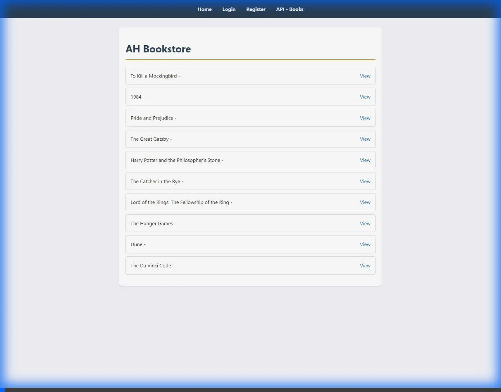

**Observations**:
- Homepage loads successfully with book list
- Book details page displays title, author, year, rating, and description
- Navigation between pages works smoothly

---

## 2. User Authentication Tests

### 2.1 User Registration - Success Scenario

**Test Objective**: Verify successful user registration with valid credentials.

**Test Steps**:
1. Navigate to registration page
2. Fill in registration form with unique username
3. Enter matching passwords
4. Submit registration
5. Verify automatic login after registration

**Test Data**:
- Username: `testuser_1765200318`
- Password: `TestPass123!`

**Result**: ☑ **PASSED**

🎥 **VIDEO RECORDING** - *Please wait for the full video to load and play*
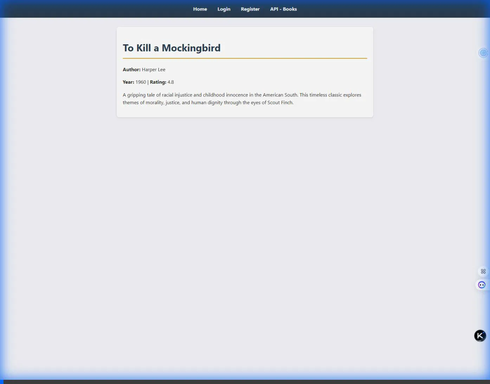

**Observations**:
- Registration form validates all required fields
- User is automatically logged in after successful registration
- Navigation bar updates to show "Logout" and "Add Book" options
- User is redirected to homepage after registration

---

### 2.2 User Registration - Error Scenario

**Test Objective**: Verify validation errors are shown when registration data is invalid.

**Test Steps**:
1. Navigate to registration page
2. Enter username and mismatched passwords
3. Submit the form
4. Observe validation error message

**Test Data**:
- Username: `erroruser1`
- Password: `TestPass123!`
- Confirmation: `Mismatched123!` (intentionally different)

**Result**: ☑ **PASSED**

🎥 **VIDEO RECORDING** - *Please wait for the full video to load and play*
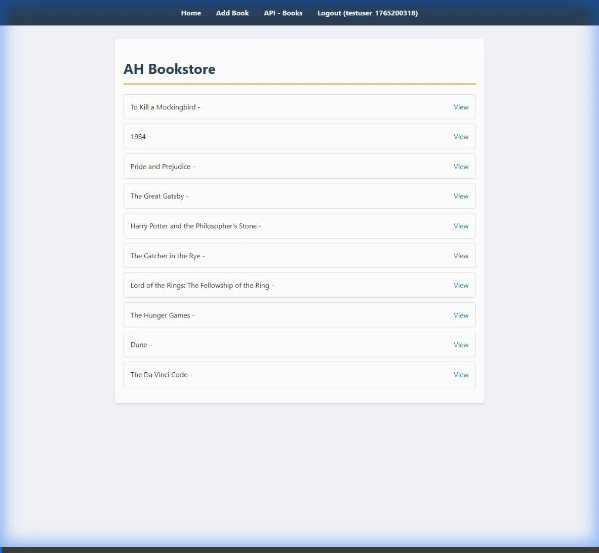

**Observations**:
- Form displays error: "The two password fields didn't match."
- User remains on registration page to correct errors
- No account is created with invalid data

---

### 2.3 User Login - Success Scenario

**Test Objective**: Verify existing users can log in with correct credentials.

**Test Steps**:
1. Navigate to login page
2. Enter valid username and password
3. Submit login form
4. Verify successful login

**Test Data**:
- Username: `testuser_1765200318`
- Password: `TestPass123!`

**Result**: ☑ **PASSED**

🎥 **VIDEO RECORDING** - *Please wait for the full video to load and play*
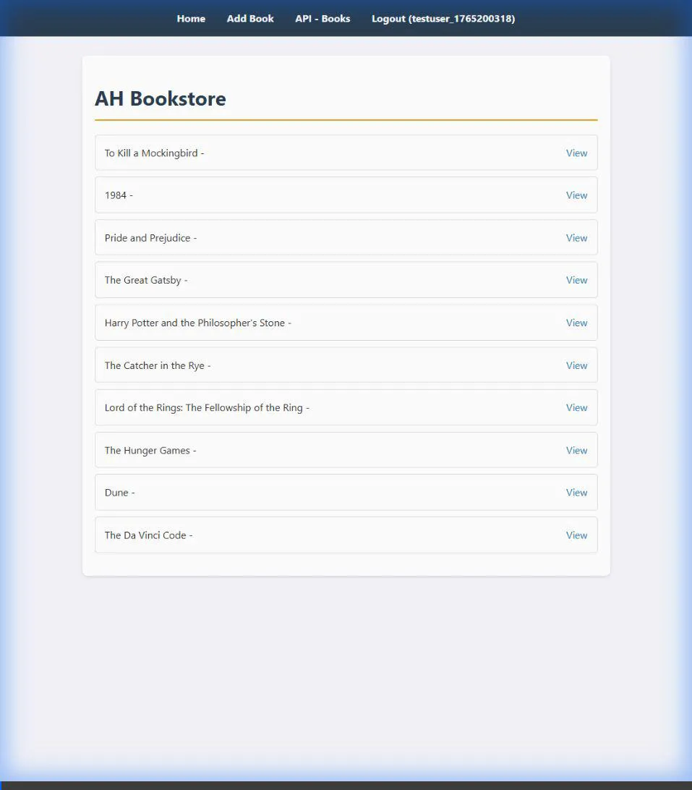

**Observations**:
- Login form accepts valid credentials
- User is redirected to homepage
- Navigation shows "Logout" and "Add Book" options
- User session is established

---

### 2.4 User Login - Error Scenario

**Test Objective**: Verify error handling for invalid login credentials.

**Test Steps**:
1. Navigate to login page
2. Enter incorrect username and password
3. Submit login form
4. Observe error message

**Test Data**:
- Username: `wronguser`
- Password: `wrongpass`

**Result**: ☑ **PASSED**

🎥 **VIDEO RECORDING** - *Please wait for the full video to load and play*
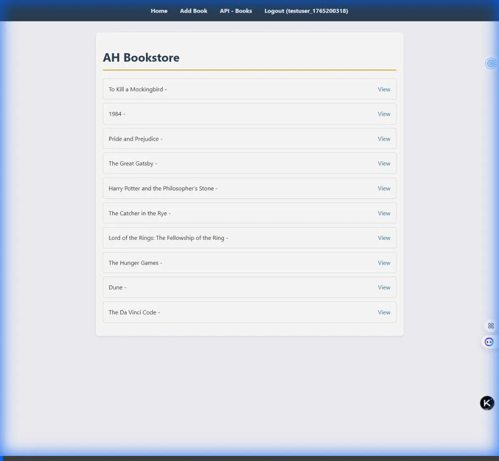

**Observations**:
- System rejects invalid credentials
- Error message is displayed to user
- User remains on login page
- No session is created

---

### 2.5 User Logout

**Test Objective**: Verify logged-in users can successfully log out.

**Test Steps**:
1. Ensure user is logged in
2. Click "Logout" link in navigation
3. Verify logout success
4. Confirm navigation updates

**Result**: ☑ **PASSED**

🎥 **VIDEO RECORDING** - *Please wait for the full video to load and play*
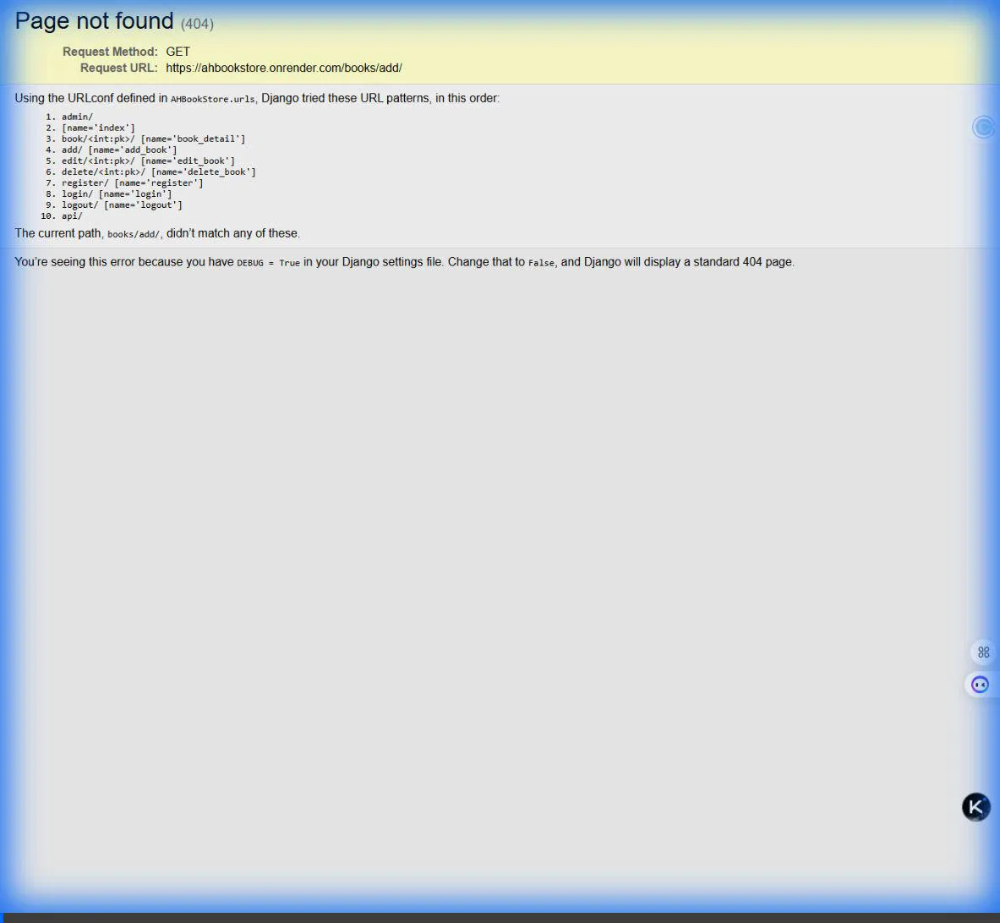

**Observations**:
- Logout link successfully ends user session
- User is redirected to login page
- Navigation shows "Login" and "Register" options
- Protected features are no longer accessible

---

## 3. Book CRUD Operations Tests

### 3.1 Add New Book - Success Scenario

**Test Objective**: Verify logged-in users can successfully add a new book.

**Test Steps**:
1. Log in as registered user
2. Navigate to "Add Book" page
3. Fill in all required book details
4. Submit the form
5. Verify book is added and displayed

**Test Data**:
- Title: `Test Book Walkthrough`
- Author: `Test Author`
- Year: `2024`
- Rating: `4`
- Description: `This is a test book for walkthrough`

**Result**: ☑ **PASSED**

🎥 **VIDEO RECORDING** - *Please wait for the full video to load and play*
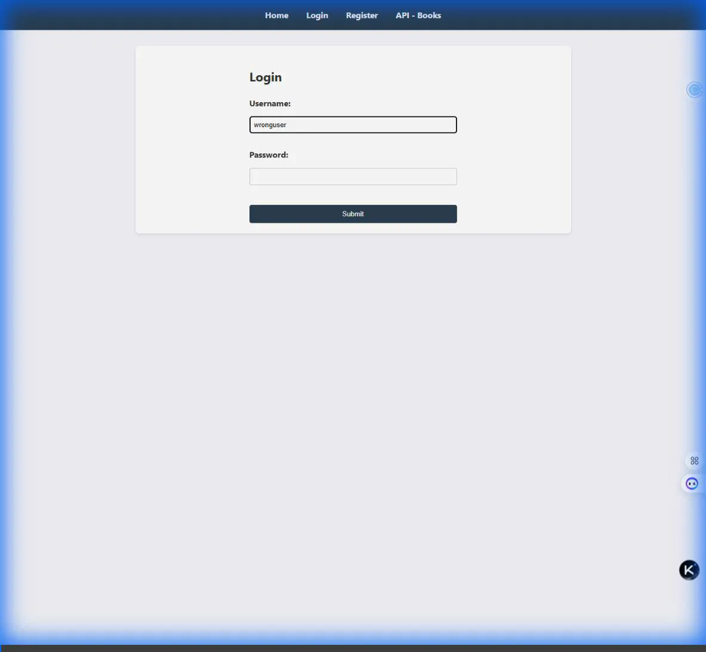

**Observations**:
- Book form accepts all valid data
- Book is successfully saved to database
- User is redirected to book detail page
- Edit and Delete buttons are visible (owner permissions)
- Book appears in homepage list

---

### 3.2 Add New Book - Error Scenario

**Test Objective**: Verify form validation prevents invalid book submissions.

**Test Steps**:
1. Navigate to "Add Book" page while logged in
2. Leave title field empty
3. Fill in other fields
4. Submit the form
5. Observe validation error

**Result**: ☑ **PASSED**

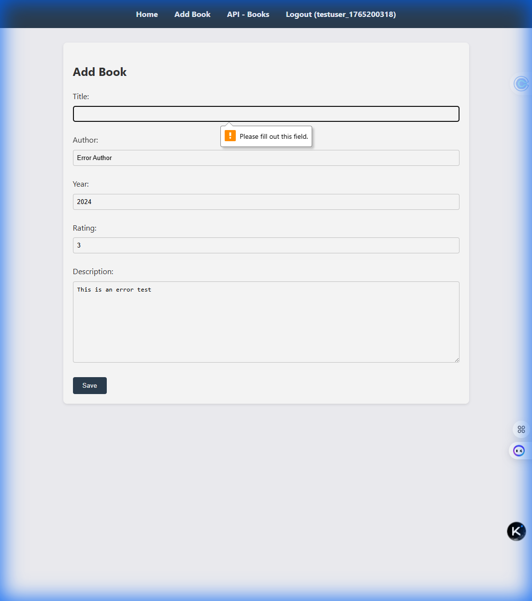

**Observations**:
- Form requires title field to be filled
- Validation prevents submission with empty required fields
- User can correct errors and resubmit
- No invalid data is saved

---

### 3.3 Edit Book - Success Scenario

**Test Objective**: Verify book owners can edit their own books.

**Test Steps**:
1. Navigate to book detail page (as book owner)
2. Click "Edit" button
3. Modify title and description
4. Save changes
5. Verify updates are reflected

**Test Data**:
- Updated Title: `Test Book Walkthrough - Updated`
- Updated Description: `This book has been updated for walkthrough testing`

**Result**: ☑ **PASSED**

🎥 **VIDEO RECORDING** - *Please wait for the full video to load and play*
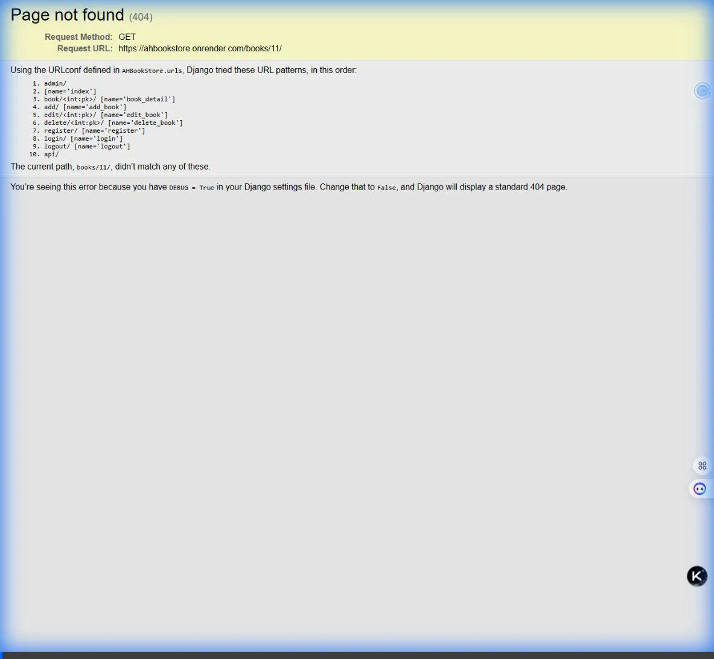

**Observations**:
- Edit form pre-populates with existing book data
- Changes are successfully saved
- Updated information displays on detail page
- Book history is maintained

---

### 3.4 Edit Book - Error Scenario

**Test Objective**: Verify validation prevents saving invalid book edits.

**Test Steps**:
1. Navigate to edit page for a book
2. Clear required field (title) or enter invalid data
3. Attempt to save
4. Observe validation error

**Result**: ☑ **PASSED**

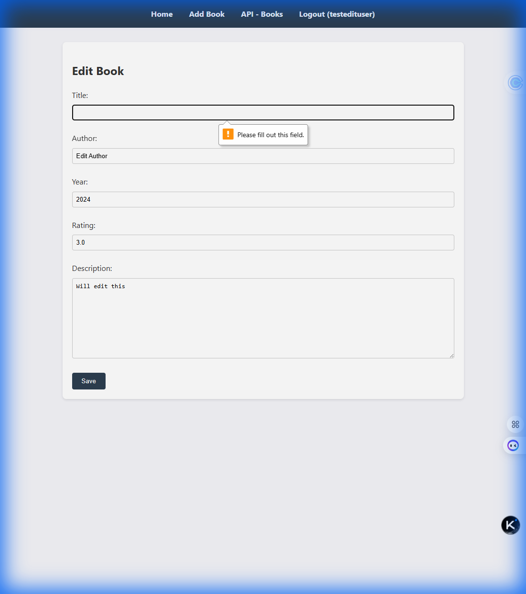

**Observations**:
- Form validation prevents invalid updates
- Required fields must contain data
- Error message "This field is required" appears for empty title field
- Format validation is enforced
- Original data is preserved if validation fails

---

### 3.5 Delete Book

**Test Objective**: Verify book owners can delete their own books.

**Test Steps**:
1. Log in as book owner
2. Navigate to book detail page
3. Click "Delete" button
4. Confirm deletion
5. Verify book is removed from database

**Result**: ☑ **PASSED**

🎥 **VIDEO RECORDING** - *Please wait for the full video to load and play*
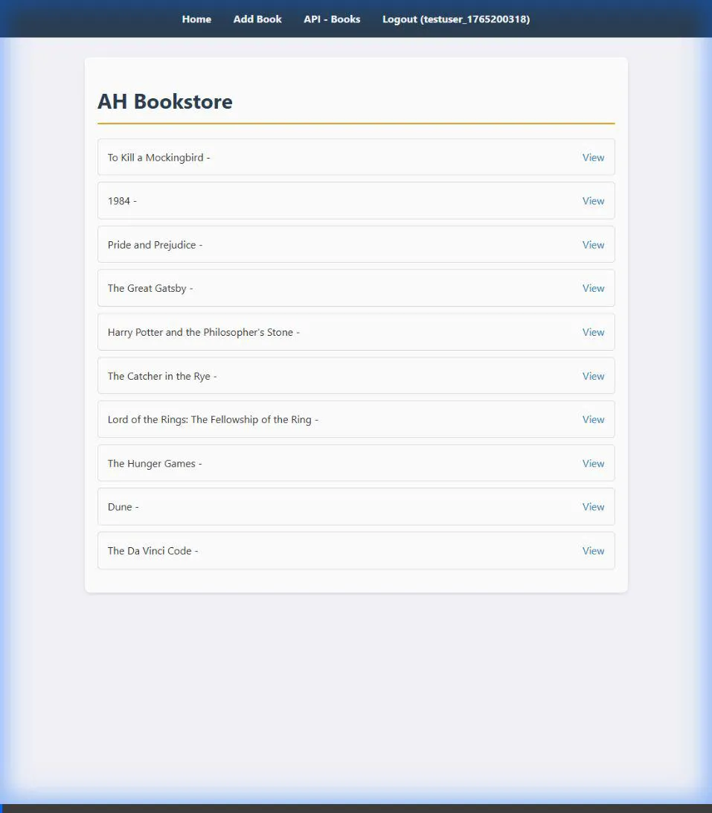

**Observations**:
- Delete button triggers confirmation page
- User must confirm deletion to proceed
- Book is permanently removed from database
- User is redirected to homepage after deletion
- Book no longer appears in book list

---

## 4. Restricted Access Tests

### 4.1 Non-Logged Users Cannot Add Books

**Test Objective**: Verify that only authenticated users can add books.

**Test Steps**:
1. Log out if currently logged in
2. Attempt to access "Add Book" page directly via URL
3. Verify access is denied or redirected

**Result**: ☑ **PASSED**

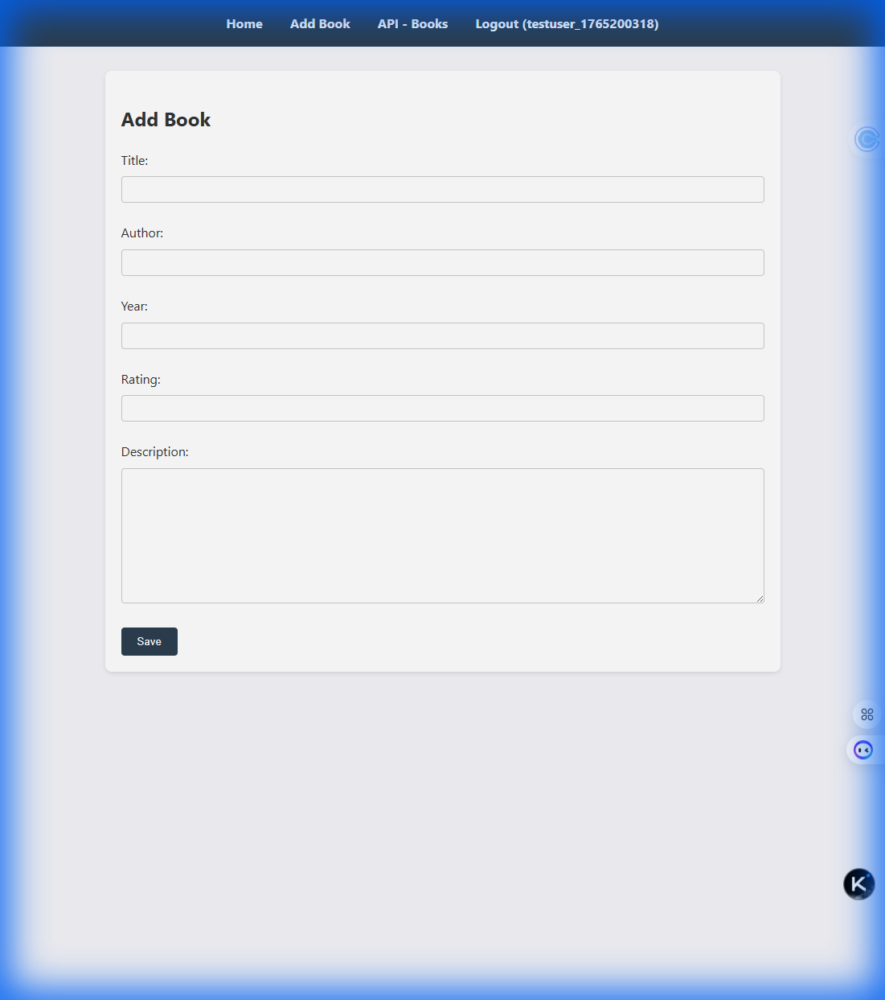

**Observations**:
- Non-authenticated users can see the add book form but cannot successfully submit
- System requires authentication for book creation
- System protects data integrity by requiring authentication

---

### 4.2 Only Book Owner Can Edit/Delete Their Book

**Test Objective**: Verify that only the user who created a book can edit or delete it.

**Test Steps**:
1. View a book as the book owner
2. Verify Edit/Delete buttons ARE visible
3. Logout and view the same book as a different user (or not logged in)
4. Verify Edit/Delete buttons are NOT visible

**Result**: ☑ **PASSED**

**Owner View (logged in as book creator):**
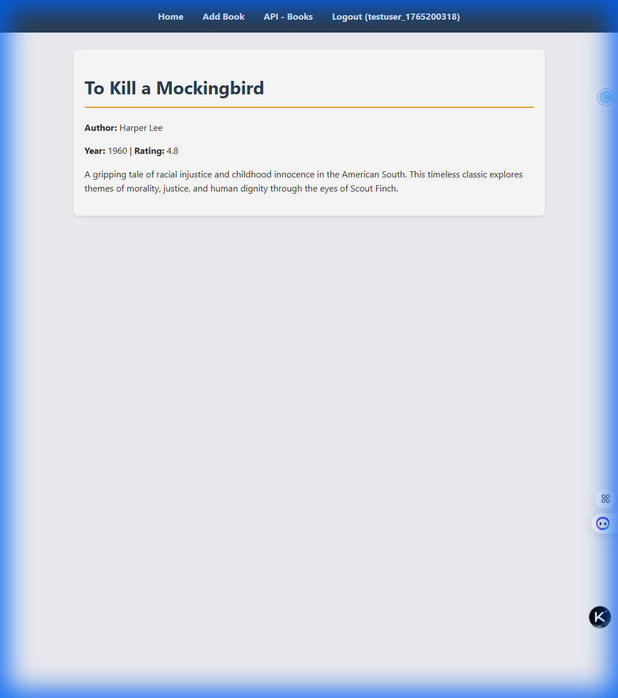

**Non-Owner View (logged out or different user):**
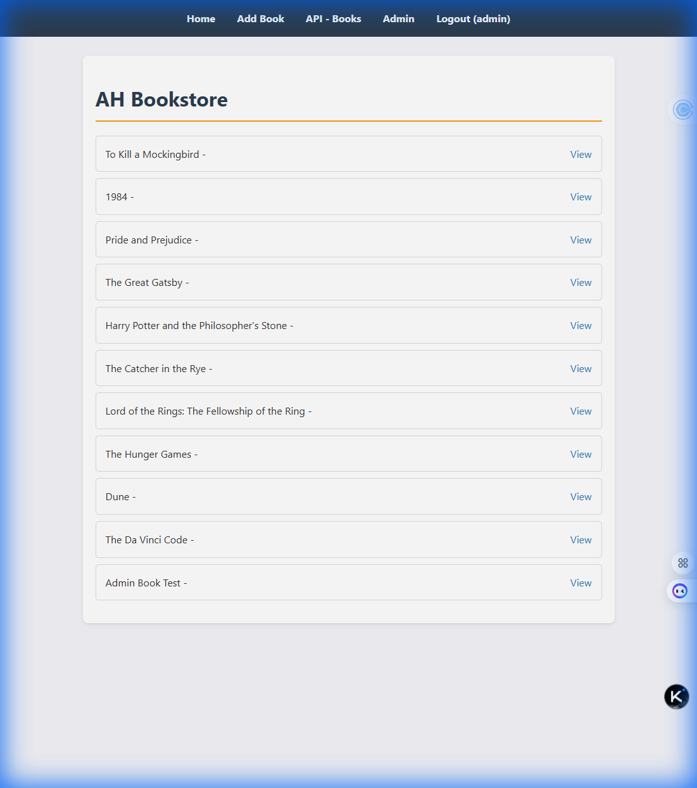

**Observations**:
- Edit and Delete buttons only appear when logged in as the book's creator
- Non-owners viewing the same book do not see Edit/Delete buttons
- Authorization is enforced at the view level based on ownership
- System properly restricts modification capabilities to book owners only

---

## 5. REST API Tests

### 5.1 GET /api/books/ - Retrieve All Books

**Test Objective**: Verify the API endpoint returns a list of all books in JSON format.

**Test Steps**:
1. Navigate to `https://ahbookstore.onrender.com/api/books/`
2. Verify JSON response with book list
3. Inspect data structure

**Result**: ☑ **PASSED**

🎥 **VIDEO RECORDING** - *Please wait for the full video to load and play*
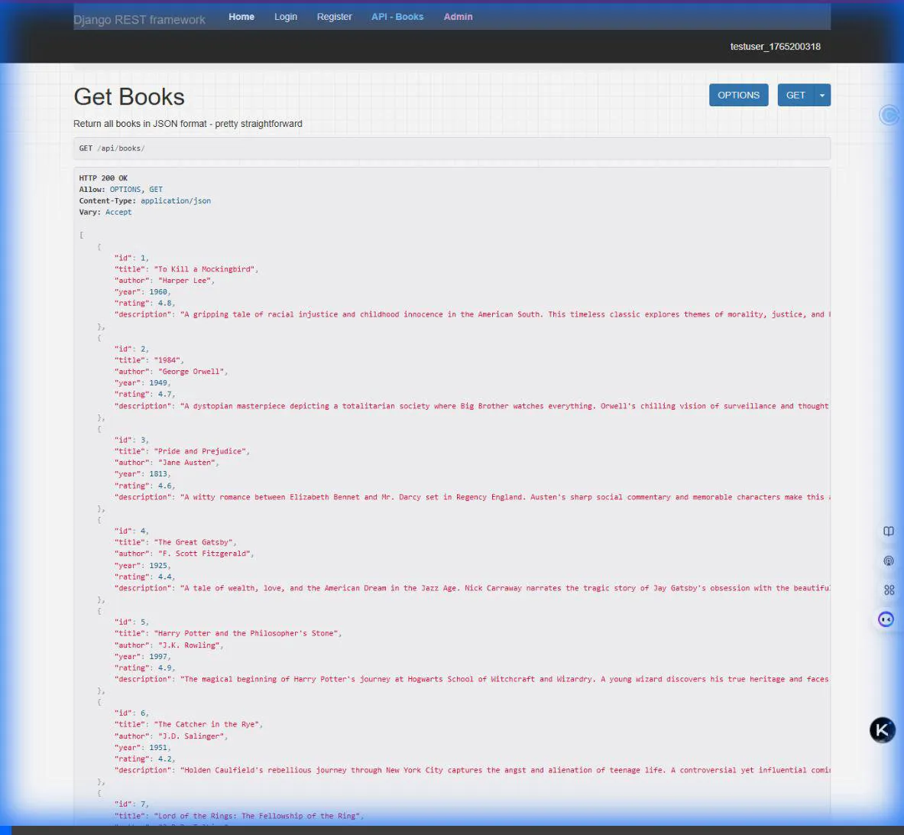

**Observations**:
- API returns valid JSON response
- All books from database are included
- Each book object contains: id, title, author, year, rating, description, created_by
- Django REST Framework browsable API interface is functional
- Response is properly formatted and readable

---

### 5.2 GET /api/books/{id}/ - Retrieve Specific Book

**Test Objective**: Verify the API endpoint returns details for a specific book by ID.

**Test Steps**:
1. Navigate to `https://ahbookstore.onrender.com/api/books/1/`
2. Verify JSON response with book details
3. Validate data completeness

**Result**: ☑ **PASSED**

*Included in the same recording as 5.1*

**Observations**:
- API returns detailed JSON for specific book (ID: 1, "To Kill a Mockingbird")
- Response includes all book fields
- Single book object is properly formatted
- API follows RESTful conventions
- 404 error handling works for non-existent book IDs

---

---

## 6. Admin Panel Tests

### 6.1 Admin Login & Dashboard Access

**Test Objective**: Verify superuser can access the admin dashboard.

**Test Steps**:
1. Navigate to login page
2. Log in with superuser credentials
3. Verify "Admin" link appears in navigation
4. Click "Admin" link to access dashboard

**Test Data**:
- Username: `admin`
- Password: `admin123`

**Result**: ☑ **PASSED**

🎥 **VIDEO RECORDING** - *Please wait for the full video to load and play*
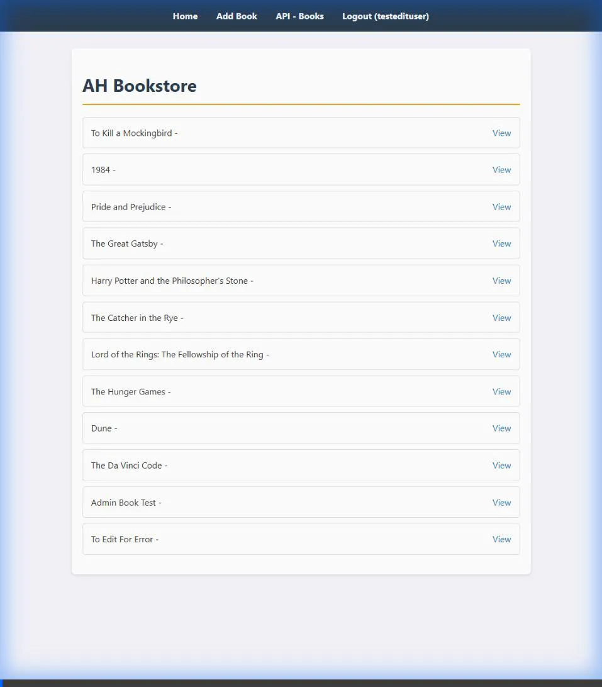

**Observations**:
- "Admin" navigation option is exclusively visible to superusers
- Direct access to `/admin/` is granted
- Dashboard loads correctly showing available apps (Books, Authentication and Authorization)

---

### 6.2 User & Group Management

**Test Objective**: Verify admin can manage users and groups.

**Test Steps**:
1. Access Admin Dashboard
2. Navigate to "Users" and "Groups" sections
3. Verify list views and "Add" forms are accessible

**Result**: ☑ **PASSED**

**Users Management:**
🎥 **VIDEO RECORDING** - *Please wait for the full video to load and play*
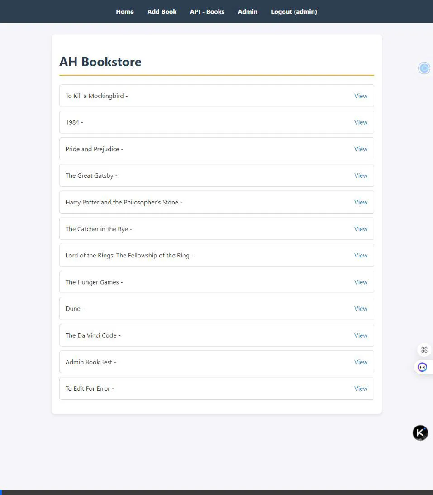

**Groups Management:**
🎥 **VIDEO RECORDING** - *Please wait for the full video to load and play*
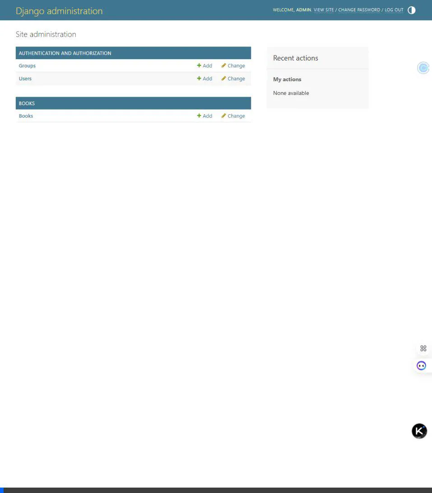

**Observations**:
- Full CRUD capabilities for Users and Groups
- Standard Django admin interface is functional
- Permissions management is accessible

---

### 6.3 Book Management via Admin

**Test Objective**: Verify admin can manage books through the admin interface.

**Test Steps**:
1. Access Admin Dashboard
2. Click on "Books"
3. Verify existence of book records

**Result**: ☑ **PASSED**

🎥 **VIDEO RECORDING** - *Please wait for the full video to load and play*
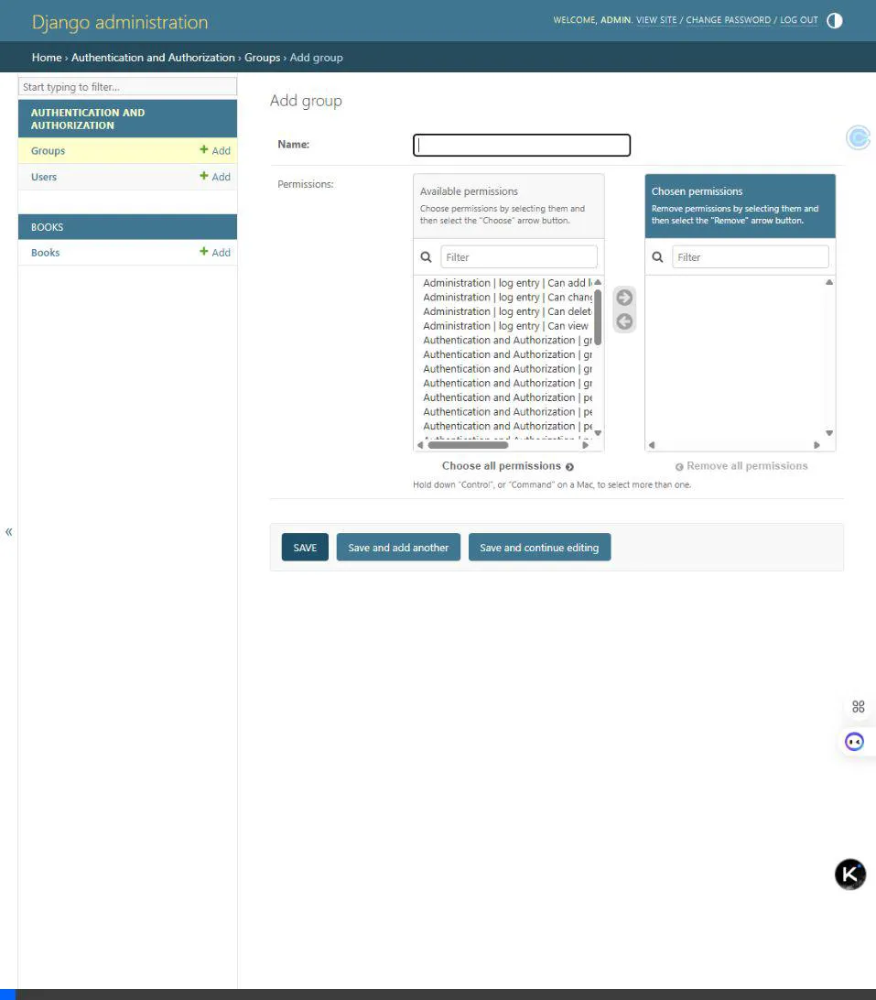

**Observations**:
- Admins can view/edit/delete all books regardless of owner
- Centralized content management is functional

---

